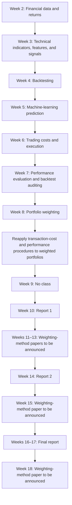

# 115學年度第1學期課程教學大綱

學年：115學年 
學期：第1學期 
開課班級：M0L20A 資訊管理系碩士班二年甲班 
科目代碼：M0L23910 
科目名稱：智慧金融科技（ARTIFICIAL INTELLIGENCE IN FINTECH） 
學分數：3.0學分 
每週上課時數：3.0小時 
任課老師：李文毅

## 教學目標

This EMI course develops a reproducible workflow for AI-driven quantitative trading and portfolio weighting. The learning sequence is financial data, technical indicators and features, signals, backtesting, machine-learning prediction, trading costs, performance evaluation, and weighting.

After completing the course, students should be able to prepare financial data, preserve information boundaries, construct and evaluate a trading strategy, compare portfolio-weighting methods, develop a clearly defined modification of an existing method, and communicate evidence and limitations in professional English. Papers for Weeks 11, 12, 13, 15, and 18 will be announced later.

## 教學內容

Students begin with prices, returns, trading calendars, information timing, technical indicators, features, and signals. Every calculation must use information available at the stated decision time.

Students then convert signals into positions and returns, estimate prediction models chronologically, add execution assumptions and transaction costs, and evaluate performance, risk, uncertainty, and backtest validity.

The course next introduces basic portfolio-weighting methods. Through reports and paper discussions, each team develops and evaluates a modification of an existing method under common data, constraints, costs, and out-of-sample conditions.

## Course learning structure

## Course coverage and evidence

| Learning area | Weeks | Question students should answer | Observable evidence |
| --- | ---: | --- | --- |
| Financial data and returns | 2 | What do the asset, field, date, unit, currency, and return represent? | Audited data and return calculations using valid holding intervals. |
| Features and signals | 3 | How can a financial idea become a feature and signal without using unavailable information? | A financial hypothesis, trailing features, leakage checks, and a dated signal. |
| Backtesting | 4 | How do signals become lagged positions, trades, gross returns, and wealth? | A reproducible gross-return ledger with accounting checks. |
| Machine-learning prediction | 5 | How can a model predict a later outcome using only information available at the prediction time? | A dated prediction table, chronological baselines, updating rules, and a protected evaluation period. |
| Trading costs and execution | 6 | How do execution and cost assumptions change gross results into net results? | A dated turnover and cost ledger, execution-delay checks, and compatible benchmarks. |
| Performance and validity | 7 | What do return, risk, drawdown, uncertainty, and backtest checks permit us to conclude? | Common-condition performance evidence and a conclusion limited to the completed checks. |
| Portfolio weighting | 8 | How are dated inputs converted into feasible weights and compared under common conditions? | Constraint checks, target and holding weights, rebalancing, turnover, net results, and sensitivity analysis. |
| Report 1 | 10 | Can the team connect data, prediction, signals, backtesting, costs, performance, and an initial weighting approach? | A frozen Git version with a team-defined and justified mapping from model output or signals to weights. |
| Weighting-method research | 11–15 | How can a limitation of an established method motivate a precise and testable modification? | Source-based method analysis, a proposed modification, preliminary evidence, and Report 2. Specific papers will be announced later. |
| Final evaluation | 16–17 | Does the modification remain defensible under common out-of-sample conditions? | A frozen final report, oral defense, and evidence-based comparison of the other teams. |
| Further paper discussion | 18 | Which unresolved limitation could guide later research? | A paper-based discussion connected to limitations found in the final reports. |

Week 8 provides common baseline weighting and comparison procedures. The selected course papers and each team's cited sources must provide any additional mathematical, optimization, or empirical background required for the proposed modification.

## 第一週

English: Week 1 introduces the course direction, learning outcomes, assessment, reporting, GitHub use, and generative-AI policy.

中文：第一週介紹課程方向、學習成果、評量、報告、GitHub使用及生成式人工智慧規範。

## 第二週

English: Week 2 covers financial prices, returns, corporate actions, missing values, trading calendars, and variable alignment.

中文：第二週介紹金融價格、報酬率、公司行動、缺失值、交易日曆及變數對齊。

## 第三週

English: Week 3 covers information timing, technical indicators, financially motivated features, leakage checks, and trading signals.

中文：第三週介紹資訊時間、技術指標、財務特徵、資訊洩漏檢查及交易訊號。

## 第四週

English: Week 4 converts signals into positions, trades, returns, and a reproducible backtest.

中文：第四週將交易訊號轉換為部位、交易與報酬，並建立可重現的回測。

## 第五週

English: Week 5 introduces machine-learning prediction, chronological evaluation, rolling and expanding windows, and walk-forward updating.

中文：第五週介紹機器學習預測、時間順序評估、滾動與擴展視窗，以及逐步向前更新。

## 第六週

English: Week 6 adds transaction costs, execution delay, turnover, and benchmark comparisons to backtests.

中文：第六週將交易成本、執行延遲、週轉率及基準比較納入回測。

## 第七週

English: Week 7 evaluates return, risk, drawdown, turnover, uncertainty, overfitting, and backtest validity.

中文：第七週評估報酬、風險、回撤、週轉率、不確定性、過度配適及回測有效性。

## 第八週

English: Week 8 introduces portfolio constraints and equal, market-capitalization, signal-based, and inverse-volatility weighting.

中文：第八週介紹投資組合限制、等權重、市值加權、訊號式加權及反波動度加權。

## 第九週

English: Week 9 has no class because of instructor travel.

中文：第九週因教師出國停課。

## 第十週

English: Week 10 contains Report 1 on prediction, quantitative trading, backtesting, and the initial weighting approach.

中文：第十週進行第一次報告，內容包含預測、量化交易、回測及初步加權方法。

## 第十一週

English: Week 11 discusses papers related to weighting methods.

中文：第十一週討論與投資組合加權方法相關的論文。

## 第十二週

English: Week 12 discusses papers related to weighting methods.

中文：第十二週討論與投資組合加權方法相關的論文。

## 第十三週

English: Week 13 discusses papers related to weighting methods.

中文：第十三週討論與投資組合加權方法相關的論文。

## 第十四週

English: Week 14 contains Report 2 on the proposed weighting-method modification and preliminary evidence.

中文：第十四週進行第二次報告，說明加權方法的修改與初步證據。

## 第十五週

English: Week 15 discusses papers related to weighting methods.

中文：第十五週討論與投資組合加權方法相關的論文。

## 第十六週

English: Week 16 is the first final-report session.

中文：第十六週進行第一場期末報告。

## 第十七週

English: Week 17 is the second final-report session, followed by evidence-based comparison and ranking of the other teams.

中文：第十七週進行第二場期末報告，並以證據比較與排序其他組別。

## 第十八週

English: Week 18 discusses papers related to weighting methods.

中文：第十八週討論與投資組合加權方法相關的論文。

## 成績評量

- Class participation and weekly learning evidence — 40 points

- Report 1 — Quantitative Trading Report: 15 points

- Report 2 — Weighting Method Progress Report: 15 points

- Report 3 — Final Report: 30 points

Detailed requirements for the three reports will be provided in the corresponding report-week files.

## 課程運作與繳交說明

The [course statement and GenAI policy](../GenAI使用規範.md) apply throughout the semester. Detailed report instructions are provided for [Report 1](../10/week10_main.md), [Report 2](../14/week14_main.md), and the [final report](../16/week16_main.md).

### Report submission through GitHub

Reports are submitted through GitHub according to the instructions in the corresponding report-week file. The main report, presentation, and oral explanation use English. Do not place credentials, restricted data, grading records, or personal information in a public repository.

### Frozen version

At each report deadline, each team identifies one Git commit as the frozen version for presentation and evaluation. Later commits do not replace the frozen version. If an error is corrected afterward, the team must retain the original version and explain how the correction affects the results and conclusions.

### Presentation and comparison

Students do not evaluate their own team. Comparisons of other teams must use common financial evidence and clearly stated criteria. Rankings received from classmates do not directly determine team grades. Individual reviews, rankings, and other grading-related personal records must remain private.

Approved accommodations follow the university's official procedure while preserving the assessed learning outcomes.

## 指定教科書及參考書籍

The course does not require a single textbook. Weeks 2–8 primarily use instructor-prepared notebooks and open or authorized financial datasets. Weeks 11, 12, 13, 15, and 18 use papers related to weighting methods. Assigned papers and accessible versions will be announced through the course GitHub repository.

The course uses each source only for claims it can support:

| Source | Used to support | Does not by itself establish |
| --- | --- | --- |
| Academic books and papers | Financial and statistical definitions, methods, and research findings | The behavior of a current software package or the accuracy of a particular downloaded observation |
| Regulator, exchange, company, and data-provider records | Security identity, corporate events, trading calendars, field definitions, and stated observations | That a trading or weighting method is effective |
| Official software documentation | Package, function, and API behavior | A financial theory or empirical investment claim |
| Controlled teaching examples | A calculation, assumption, or failure case | A real-market fact or future investment performance |
