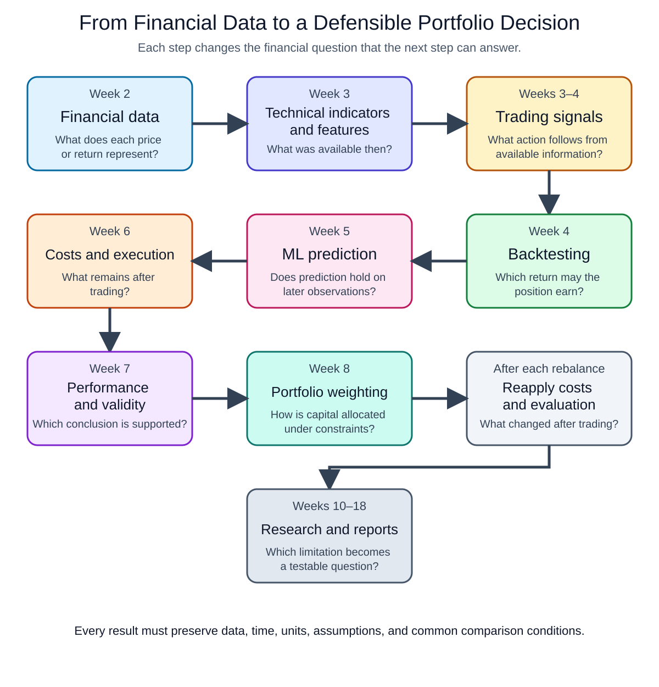

# Week 1 — From an Investment Idea to a Testable Quantitative Trading Question

[Read the complete course syllabus](../README.md).

## What you will learn

Before building a trading strategy, decide what result would answer your investment question. This week, you will turn one broad idea into a question with a stated decision, comparison, and outcome. No coding or return calculation is required.

## Course workflow

*Figure 1. The course builds a trading strategy step by step. Changing portfolio weights requires checking costs and performance again. Select the figure to open it at full size.*

## 1. Before following the workflow, decide what you want to test

Figure 1 shows what we will build. It does not tell us **what would count as evidence for our investment idea**. That decision comes first: it determines which data, model, backtest, and comparison we need.

Consider this idea:

> AI can select better investments.

“Better” could mean a higher return, a smaller loss, or less trading. These are different questions. For this example, choose one: **does the model-based allocation earn a higher return after costs than a fixed allocation?**

We will specify this comparison before calculating anything.

## 2. Turn the idea into one comparison

The following settings are illustrative, not the official Report 1 requirements. They describe a proposed experiment, not observed investment results.

| Decision to specify | Settings for this example |
| --- | --- |
| Assets and baseline | Apple common stock (intended label AAPL), Microsoft common stock (MSFT), and USD cash. Compare the model-based allocation with 50% in each stock. |
| Model-based allocation | Predict each stock's next-session opening-to-closing price return. Set negative predictions to zero and allocate in proportion to the positive predictions. If neither is positive, hold cash. No short selling. |
| Information and decision time | Use a session's daily prices and volume only after they have actually been received. Finish the prediction and allocation before the next regular session opens; a closing timestamp alone does not establish availability. |
| Execution and holding interval | Both portfolios assume stock purchases at the next regular session's opening and sales at its closing. These are execution assumptions, not verified fills. |
| Development and evaluation | Fit and select the model and rule using outcomes ending no later than December 29, 2023. Evaluate opening-to-closing intervals from January 2 through December 31, 2024, without using those outcomes for fitting or selection. |
| Common conditions | Same securities, evaluation sessions, starting capital of USD 100,000, execution schedule, and cost assumptions. Charge 10 basis points (0.10%) of each amount bought or sold. |
| Primary outcome | Net cumulative return: the percentage change in portfolio value over the evaluation period after costs. A result no higher than the baseline would not support the proposed advantage. |

Before running this experiment, verify the securities, price fields, and trading calendar. Also specify whether cash earns interest and how trading costs are deducted from available funds. Allocations must be affordable after costs. Apply these conventions to both portfolios; the assumed cost is not a measured historical fee.

Now the question can be short because the table supplies its conditions:

> Under these settings, does the model-based allocation produce a higher net cumulative return than the 50%–50% baseline during 2024?

This compares the **complete allocation rules**, not the prediction model alone. Even a higher historical net return would not establish future profitability. At this stage, we have a question and proposed settings—not an answer or a fully implemented backtest.

## 3. Check whether the comparison answers that question

Suppose Team A reports a return before costs, while Team B reports a return after costs. Their numbers do not answer our question on common terms. Both must apply the same cost definition before comparing net returns.

Timing matters too. If a day's price data arrive at 16:05, a decision at 16:00 cannot use them. This is a hypothetical clock example, not a claim about a provider's release schedule. Moving the decision later still requires an execution opportunity after the decision.

These checks explain why Figure 1 starts with data and proceeds through signals, execution, and evaluation. A sophisticated model cannot repair unavailable inputs or inconsistent comparisons.

## 4. Your turn: make one change and rewrite the question

Keep the example's assets and evaluation period. Choose a different allocation rule to compare with the same baseline; describe the rule in words without calculating weights or returns.

Use one short table:

| Question to settle | Your proposed answer |
| --- | --- |
| What allocation rule changes, and what baseline remains? | |
| Which inputs are needed, when are they available, and when can the decision be executed? | |
| Which outcome and holding interval will be compared? | |
| Which data, dates, costs, and other conditions stay fixed? | |
| What result would not support your proposed advantage? | |
| What still needs verification before calculation, and where must the conclusion stop? | |

Write one question using your table. Ask a classmate to identify one missing condition that could change the comparison, then revise it. If they find none, ask them to explain why the stated comparison is consistent.

Keep only the table, your question, and the peer comment with your response. The activity is complete when another student can tell what changes, what stays fixed, what evidence would answer the question, and what remains unknown.

## Next: obtain the evidence

Week 1 defines the question. [Week 2 — Financial Data and Returns](week02_main.ipynb) checks what the proposed prices, dates, and returns mean. Week 3 determines which features and signals can be available before a decision. Later weeks build and evaluate the strategy.

The [syllabus](../README.md) and [course statement and GenAI policy](GenAI使用規範.md) contain the course rules. This activity does not add a report requirement or a grading rule.
